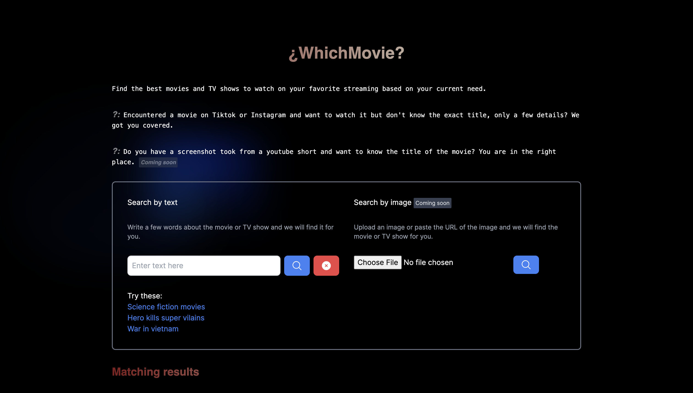
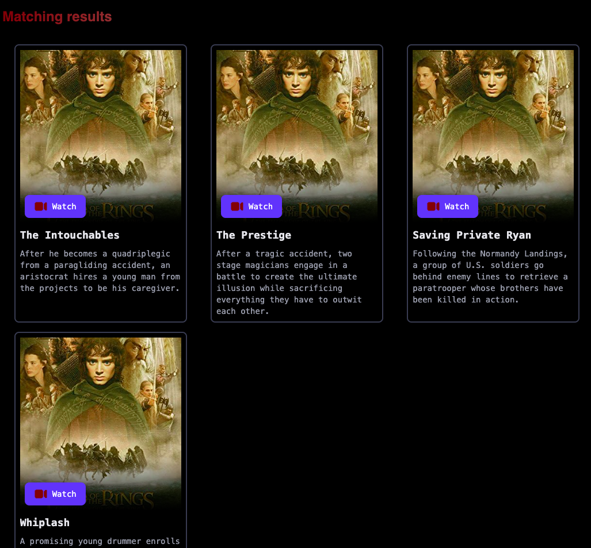

# Movie Recommendation

Powered by 

## 🎥 ¿WhichMovie?

**¿WhichMovie?** is a movie recommendation application that helps users find the best movies and TV shows to watch on their favorite streaming platforms based on their current needs. Whether you've encountered a movie on TikTok or Instagram and want to watch it but don't know the exact title or just have a few details, WhichMovie? has got you covered.

## 🛠️ Features

- **Search by Text:** Enter a few words about the movie or TV show, and WhichMovie? will find it for you.
- **Search by Image _(Coming Soon)_:** Upload an image or paste the URL of the image, and we will find the movie or TV show for you.

## 📷 Screenshots

Main page


Movies result


Loading component


## 🎥 Demo Video
https://www.loom.com/share/6d8256ae04034b8488309c55c29e46b5?sid=ae1a4b2e-b4fb-4390-9906-a476a46d9131

## 🚀 Tech Stack

- **Frontend**: React, Next.js, Tailwind CSS
- **Backend**: Node.js, Weaviate
- **Other Tools**: Weaviate vectorizer, HugginFace API

## 🔧 Setup and Installation

### Clone the repository:

```bash
git clone https://github.com/pacyL2K19/whichmovie.git
cd whichmovie
```
### Install dependencies:

```bash
yarn install
```

### Setup a Weaviate Cluster

Follow [This guide](https://weaviate.io/developers/wcs/quickstart) and make sure you get your cluster API Key and url

You will also need a `HuggingFace` API Key to proceed. Having a HF account, you can get yours [here](https://huggingface.co/settings/tokens)

Create a `.env.local` file in the root directory with the following variables:

```md
WCD_URL=your-weaviate-cloud-domain
WCD_API_KEY=your-weaviate-cloud-api-key
HUGGINGFACE_API_KEY=your-hf-api-key
```

### Create a Collection and seed data

You need to create a new collection in your cluster in order to start querying the database.
Fortunately, we have created a set of customizable commands to easily set your environment

- Start with creating a new collection running the following command, passing your keys as arguments(replace placeholders with real values):
    ```bash
    yarn collection:create --collectionName=Movie --eraseIfExists=true --hfAPIKey=<YOUR_HUGGING_FACE_APIKEY> --wcdUrl=<YOUR_WCD_URL> --wcdApiKey=<YOUR_WDC_KEY>
    ```
- The command above will create a new collection and optionally erase an existing collection with the same name, you can pass whatever boolean to the `--eraseIfExists` argument depending on your use case. Then seed some data in your collection. In the context of movie recommendation, we have a small dataset of movies, feel free to use any source of your need. Run the following command to seed your collection with some data:
    ```bash
    yarn collection:seed-data --collectionName=Movie --hfAPIKey=<YOUR_HUGGING_FACE_APIKEY> --wcdUrl=<YOUR_URL> --wcdApiKey=<YOUR_WDC_KEY>
    ```
- [optional]: you can drop your collection anytime you want using the following command:
    ```bash
    yarn collection:drop --collectionName=Movie --hfAPIKey=<YOUR_HUGGING_FACE_APIKEY> --wcdUrl=<YOUR_URL> --wcdApiKey=<YOUR_WDC_KEY>
    ```

### Run the development server:

```bash
yarn dev
```
Open the application in your browser

http://localhost:3000

## 🗂️ Dataset

The application uses a dataset of popular movies to provide recommendations. Any source can be used here, for a demo purpose, we have a list of movies under the `data/dumb.ts` file. Feel free to use anyother data source.

## 🚧 Future Enhancements

- **Search by Image:** Add support for blobs and image search functionality.
- **User Accounts:** Allow users to create accounts and save their favorite movies.
- **Advanced Filters:** Add filters for genre, rating, and year to refine search results.

## 🤝 Contributing

Contributions, issues, and feature requests are welcome! Feel free to check the issues page if you want to contribute.

## 📝 License

This project is [MIT](https://github.com/pacyL2K19/whichmovie/blob/main/LICENSE) licensed.
